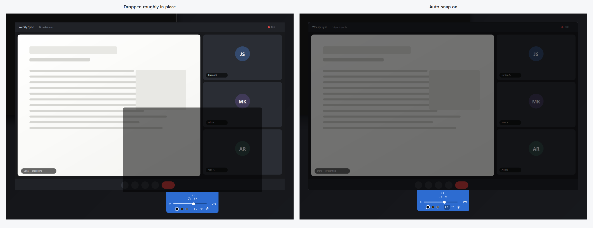

<h1 align="center">AutoTint</h1>

<p align="center">
  <em>Someone on the call is sharing a blinding white spreadsheet.<br>
  Put a dimmer on it — just for you.</em>
</p>

<p align="center">
  
</p>

<p align="center">
  
  
  
</p>

---

## The problem

A coworker joins with their brightness at maximum, or shares a document that is pure
white, and one tile of your screen is now a floodlight. Turning your own display down
dims everything else too. Dark mode does not help — it is *their* window.

AutoTint puts a translucent panel over just that rectangle. **Clicks pass straight
through it**, so the meeting app underneath keeps working exactly as before — you can
still mute, chat, and hit the leave button through the tint. The panel is something
your eyes see, not something your mouse hits.

## The tab

Everything lives in a small tab hanging under the panel. It stays readable even at 0%
tint, so you can always find your way back.

<p align="center">
  
</p>

| Control | What it does |
| --- | --- |
| Dot grip | Drag to move the panel |
| Panel edges & corners | Drag to resize |
| ⏻ | Tint off and back on, returning to the same strength |
| ☀ | Show or hide the settings |
| ⛶ | Auto-snap: line the panel up with the window beneath it |
| ◐ | Auto-adjust: set the tint from how bright the content actually is |
| Slider | Tint strength, 0–90% — or, with auto-adjust on, how bright to leave things |
| Swatches | Neutral black, warm amber, soft grey |
| 👁 | Hide the tint from screen sharing |
| ⚙ | Reset position, or quit |
| Scroll wheel over the tab | Nudge strength by 5% |
| **Alt+Shift+T** | Toggle from anywhere, even while the meeting app has focus |

## Auto-snap

Lining a panel up with a window by hand is fiddly. Turn auto-snap on and the panel finds
the window underneath it and fits itself to that window exactly — then **stays attached**,
following it as it is moved or resized, until you drag the panel somewhere else or the
window goes away.

<p align="center">
  
</p>

It pairs well with the pop-out view in Teams and Zoom: pop the offending person into their
own window, and the tint wraps precisely to it.

Behind this is a detail worth knowing if you ever build something similar. The obvious call,
`GetWindowRect`, reports a rectangle noticeably larger than the window you can see, because
Windows 10 and 11 include an invisible resize border of roughly 7px per side. On a test
window it reported `300,200 1200×800` where the visible frame was `307,200 1186×793`.
Snapping to that would leave the tint overhanging on three sides, so AutoTint asks DWM for
`DWMWA_EXTENDED_FRAME_BOUNDS` instead.

If there is nothing snappable underneath — bare desktop, the taskbar, a window too small to
be meant — the panel stays exactly where you dropped it and the snap button blinks, so the
stillness reads as *looked, found nothing* rather than as a dead button.

## Auto-adjust

Turn it on and AutoTint measures how bright the content under the panel actually is, twice
a second, and sets the tint to match. Someone switches from a dark IDE to a blinding slide
and the panel deepens on its own; they switch back and it eases off. With auto-adjust on,
the slider stops setting opacity and instead sets **how bright you are willing to leave
things** — the readout then shows the opacity it chose, as `auto 28%`.

The opacity is derived, not guessed. Alpha compositing is
`result = source × (1 − a) + tint × a`, so given a measured brightness `L`, a comfort target
`T`, and the tint colour's own brightness `Lᵗ`:

```
a = (L − T) / (L − Lᵗ)
```

With a black tint and a target of 180, a blown-out share at `L=250` gets **28%**, a milder
one at `L=200` gets **10%**, and content already at `L=170` gets **nothing at all**. It
corrects for the colour presets for free — warm amber is not as dark as black, so the same
content asks for 33% instead of 28%.

What it measures is the **90th-percentile brightness**: the level the brightest tenth of the
area exceeds. That is deliberate. A plain average would look at a dark meeting window
holding one searing white document and call it a comfortable mid-grey — which is the exact
situation this app exists for.

Readings are smoothed and small changes are ignored, so the tint settles over a few seconds
rather than flickering along with the video. Measured on this machine: about **1.4–2% of one
core**, and a jump from dark to blazing white settles in about **4 seconds**.

### Does it read my screen?

Yes — that specific rectangle, and only to count brightness. Each sample is reduced
immediately to a 256-bin histogram and the pixels are discarded. Nothing is stored, written
to disk, or sent anywhere. There is no network code in this app at all.

Sampling leans on the same `WDA_EXCLUDEFROMCAPTURE` that hides the panel from screen
sharing: it hides the tint from *our own* capture too, so AutoTint measures the real content
rather than its own dimming. Without that, dimming would darken the reading, which would
reduce the dimming, and the tint would visibly oscillate.

One consequence worth knowing: DRM-protected video captures as black, so auto-adjust reads
it as dark and applies no tint. It fails safe, but it does fail.

## Good to know

- **Quit from the tray icon.** The window is frameless and deliberately stays out of the
  taskbar and Alt+Tab, so the tray is the reliable way out. On Windows 11 new tray icons
  start in the `^` overflow flyout — drag it onto the taskbar to keep it visible.
- **Sharing your screen? Nobody else sees the tint.** Hide-from-screen-share is on by
  default, so other attendees get the original, undimmed picture. It hides the tint from
  your own screenshots too, which surprises people the first time.
- **It remembers.** Size, position, strength, colour and whether the settings were open
  are saved to `%APPDATA%\AutoTint\settings.json`. If the monitor it was last on has been
  unplugged, it recovers to a centred default instead of opening out of reach.

## Getting it running

Requires the [.NET 10 SDK](https://dotnet.microsoft.com/download).

```bash
dotnet run --project src/AutoTint    # run it
dotnet test                          # 76 unit tests
```

### Publishing

```bash
# One 234 KB exe. Needs the .NET 10 Desktop Runtime installed.
dotnet publish src/AutoTint -c Release -r win-x64 --self-contained false \
  -p:PublishSingleFile=true -o publish/portable

# Standalone, no runtime needed. ~166 MB, because it carries all of WPF.
dotnet publish src/AutoTint -c Release -r win-x64 --self-contained true \
  -p:PublishSingleFile=true -o publish/standalone
```

## How it works

The interesting part is that dragging, resizing and click-through are never implemented —
they are handed to Windows. All three fall out of one message, `WM_NCHITTEST`, which
Windows sends continuously to ask *"what is the cursor over?"* `HitTestResolver` answers
per region:

| Region | Answer | What Windows then does |
| --- | --- | --- |
| Tinted body | `HTTRANSPARENT` | — |
| Dot grip | `HTCAPTION` | Drags the window |
| Edges and corners | `HTLEFT`, `HTBOTTOMRIGHT`, … | Resizes, with the right cursors |
| Tab controls | `HTCLIENT` | Ordinary input |

**`HTTRANSPARENT` alone is not enough for click-through.** Windows only forwards those
hits to windows *on the same thread*, so with a Teams window underneath the clicks are
swallowed rather than passed on. The mechanism that works across processes is the
`WS_EX_TRANSPARENT` window style — but that applies to the whole window, controls included.

So `ClickThroughController` toggles it: click-through by default, lifted only while the
cursor is over something interactive. A 60 Hz cursor poll drives the switch and stands
down during a native drag or resize (`WM_ENTERSIZEMOVE` / `WM_EXITSIZEMOVE`), so a gesture
is never dropped when the cursor outruns the grab band.

Three smaller details that are easy to get wrong:

- Tint opacity is set on the tint `Border`, **never** on the `Window`. Window-level opacity
  would dim the tab too, and the tab has to stay readable at 0% so the tint can be switched
  back on.
- `ResizeMode="CanResize"` is required even though there is no visible border. It keeps
  `WS_THICKFRAME` on the window, and without that style Windows ignores the resize
  hit-test codes entirely and edge-dragging silently does nothing.
- The 8px corner rounding is drawn, not inherited. Windows 11 rounds ordinary top-level
  windows itself, but a layered per-pixel-transparent window has no frame for DWM to round,
  so square corners are what you get unless you draw the curve.

Window bounds are persisted in physical pixels via `GetWindowRect`/`SetWindowPos` rather
than WPF's device-independent `Left`/`Top`/`Width`/`Height`, because round-tripping those
through a mixed-DPI monitor setup is a reliable way to have the window reopen at the wrong
size.

## Layout

```
src/AutoTint/
  Views/      OverlayWindow — chrome, hit-test hook, state — and its styles
  Interop/    P/Invoke, hit-test resolver, click-through, hotkey, window and screen reading
  Services/   settings, bounds validation, tray icon, auto-snap, auto-adjust
  Models/     AppSettings, TintPreset
tests/AutoTint.Tests/
```

### Diagnostics

Two environment variables, for development:

- `AUTOTINT_DIAG=1` — dumps the window's real Win32 style bits and DPI to
  `%TEMP%\autotint-diag.log` on startup.
- `AUTOTINT_FORCE_INTERACTIVE=1` — pins the window to input-accepting, which makes the
  click-through toggle testable from outside the process.

## Not there yet

Auto-hiding tab · multiple panels · start with Windows · tinting on a schedule or by time
of day · adjusting the tint *colour* automatically as well as its strength.

---

<p align="center"><sub>The screenshot above is a mock meeting, drawn from scratch. No real
colleagues were dimmed in the making of this README.</sub></p>
