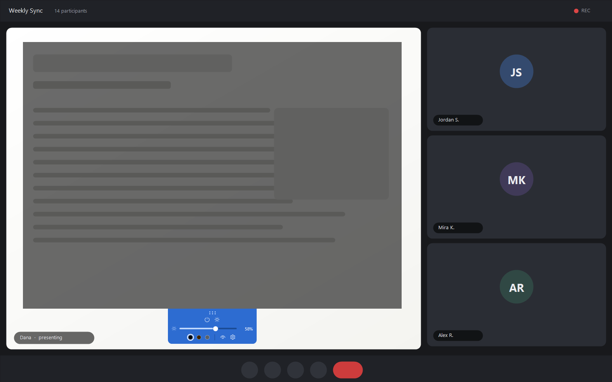
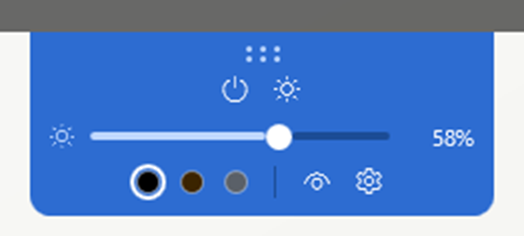

<h1 align="center">AutoTint</h1>

<p align="center">
  <em>Someone on the call is sharing a blinding white spreadsheet.<br>
  Put a dimmer on it — just for you.</em>
</p>

<p align="center">
  
</p>

<p align="center">
  
  
  
</p>

---

## The problem

A coworker joins with their brightness at maximum, or shares a document that is pure
white, and one tile of your screen is now a floodlight. Turning your own display down
dims everything else too. Dark mode does not help — it is *their* window.

AutoTint puts a translucent panel over just that rectangle. **Clicks pass straight
through it**, so the meeting app underneath keeps working exactly as before — you can
still mute, chat, and hit the leave button through the tint. The panel is something
your eyes see, not something your mouse hits.

## The tab

Everything lives in a small tab hanging under the panel. It stays readable even at 0%
tint, so you can always find your way back.

<p align="center">
  
</p>

| Control | What it does |
| --- | --- |
| Dot grip | Drag to move the panel |
| Panel edges & corners | Drag to resize |
| ⏻ | Tint off and back on, returning to the same strength |
| ☀ | Show or hide the settings |
| Slider | Tint strength, 0–90% |
| Swatches | Neutral black, warm amber, soft grey |
| 👁 | Hide the tint from screen sharing |
| ⚙ | Reset position, or quit |
| Scroll wheel over the tab | Nudge strength by 5% |
| **Alt+Shift+T** | Toggle from anywhere, even while the meeting app has focus |

## Good to know

- **Quit from the tray icon.** The window is frameless and deliberately stays out of the
  taskbar and Alt+Tab, so the tray is the reliable way out. On Windows 11 new tray icons
  start in the `^` overflow flyout — drag it onto the taskbar to keep it visible.
- **Sharing your screen? Nobody else sees the tint.** Hide-from-screen-share is on by
  default, so other attendees get the original, undimmed picture. It hides the tint from
  your own screenshots too, which surprises people the first time.
- **It remembers.** Size, position, strength, colour and whether the settings were open
  are saved to `%APPDATA%\AutoTint\settings.json`. If the monitor it was last on has been
  unplugged, it recovers to a centred default instead of opening out of reach.

## Getting it running

Requires the [.NET 10 SDK](https://dotnet.microsoft.com/download).

```bash
dotnet run --project src/AutoTint    # run it
dotnet test                          # 40 unit tests
```

### Publishing

```bash
# One 234 KB exe. Needs the .NET 10 Desktop Runtime installed.
dotnet publish src/AutoTint -c Release -r win-x64 --self-contained false \
  -p:PublishSingleFile=true -o publish/portable

# Standalone, no runtime needed. ~166 MB, because it carries all of WPF.
dotnet publish src/AutoTint -c Release -r win-x64 --self-contained true \
  -p:PublishSingleFile=true -o publish/standalone
```

## How it works

The interesting part is that dragging, resizing and click-through are never implemented —
they are handed to Windows. All three fall out of one message, `WM_NCHITTEST`, which
Windows sends continuously to ask *"what is the cursor over?"* `HitTestResolver` answers
per region:

| Region | Answer | What Windows then does |
| --- | --- | --- |
| Tinted body | `HTTRANSPARENT` | — |
| Dot grip | `HTCAPTION` | Drags the window |
| Edges and corners | `HTLEFT`, `HTBOTTOMRIGHT`, … | Resizes, with the right cursors |
| Tab controls | `HTCLIENT` | Ordinary input |

**`HTTRANSPARENT` alone is not enough for click-through.** Windows only forwards those
hits to windows *on the same thread*, so with a Teams window underneath the clicks are
swallowed rather than passed on. The mechanism that works across processes is the
`WS_EX_TRANSPARENT` window style — but that applies to the whole window, controls included.

So `ClickThroughController` toggles it: click-through by default, lifted only while the
cursor is over something interactive. A 60 Hz cursor poll drives the switch and stands
down during a native drag or resize (`WM_ENTERSIZEMOVE` / `WM_EXITSIZEMOVE`), so a gesture
is never dropped when the cursor outruns the grab band.

Two smaller details that are easy to get wrong:

- Tint opacity is set on the tint `Border`, **never** on the `Window`. Window-level opacity
  would dim the tab too, and the tab has to stay readable at 0% so the tint can be switched
  back on.
- `ResizeMode="CanResize"` is required even though there is no visible border. It keeps
  `WS_THICKFRAME` on the window, and without that style Windows ignores the resize
  hit-test codes entirely and edge-dragging silently does nothing.

Window bounds are persisted in physical pixels via `GetWindowRect`/`SetWindowPos` rather
than WPF's device-independent `Left`/`Top`/`Width`/`Height`, because round-tripping those
through a mixed-DPI monitor setup is a reliable way to have the window reopen at the wrong
size.

## Layout

```
src/AutoTint/
  Views/      OverlayWindow — chrome, hit-test hook, state — and its styles
  Interop/    P/Invoke, hit-test resolver, click-through, global hotkey
  Services/   settings persistence, bounds validation, tray icon
  Models/     AppSettings, TintPreset
tests/AutoTint.Tests/
```

### Diagnostics

Two environment variables, for development:

- `AUTOTINT_DIAG=1` — dumps the window's real Win32 style bits and DPI to
  `%TEMP%\autotint-diag.log` on startup.
- `AUTOTINT_FORCE_INTERACTIVE=1` — pins the window to input-accepting, which makes the
  click-through toggle testable from outside the process.

## Not there yet

Auto-hiding tab · multiple panels · start with Windows · snap to the window under the
cursor · scheduled or automatic tinting, which is what the *Auto* in the name is holding
a place for.

---

<p align="center"><sub>The screenshot above is a mock meeting, drawn from scratch. No real
colleagues were dimmed in the making of this README.</sub></p>
